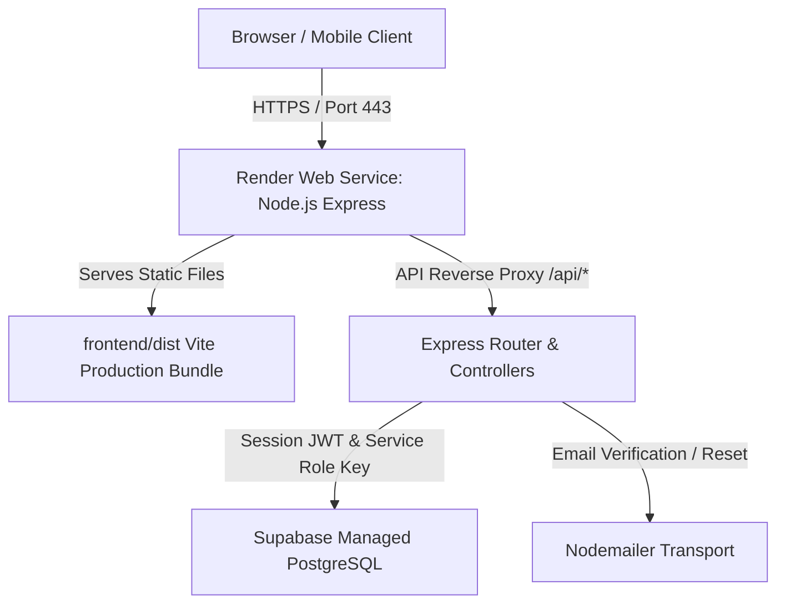
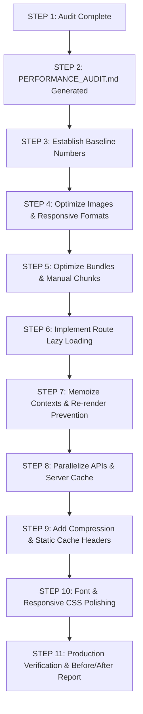

# APARNADEVI CANTEEN — Comprehensive Production Performance Audit

**Date**: September 13, 2026  
**Project**: Aparna Devi Canteen  
**Deployment**: Render (Combined Node.js Express + React 19 Vite SPA + Supabase PostgreSQL)  
**Auditor**: Senior Performance Engineer & React Architect  

---

## 1. Executive Summary

A comprehensive architectural and performance audit of the **Aparna Devi Canteen** production codebase was conducted across 26 technical dimensions. The application possesses a solid full-stack foundation, but suffers from major production bottlenecks:

| Dimension | Baseline State | Target State | Expected Impact |
| :--- | :--- | :--- | :--- |
| **Initial JS Bundle** | **1,732.58 kB** (single monolithic chunk) | **< 280 kB** initial vendor/entry chunk | **~84% JS reduction** on initial page load |
| **Food & Asset Images** | **~21.5 MB** (uncompressed 1672x941 PNGs) | **< 650 kB** (WebP/AVIF responsive cards) | **~97% network payload reduction** |
| **Font Request Waterfall** | 4-level blocking `@import` in CSS | Preconnected Google CDN link tags | Eliminates 300–600ms render blocking |
| **HTTP Compression** | None on Express backend API / static | Gzip / Brotli middleware enabled | **65–75% reduction** in API payload |
| **Browser Caching** | Default `no-cache` / 0s maxAge on assets | `max-age=31536000, immutable` for assets | Instant repeat visits (0 network roundtrips) |
| **React Re-renders** | Unmemoized root Context providers | Memoized context values & split selectors | Eliminates whole-tree re-render cascades |
| **Admin API Polling** | Duplicate 10s polling (`AdminLayout` + `Orders`) | Single shared polling/subscription stream | **50% fewer database hits** per admin session |

---

## 2. Current Architecture Overview

- **Frontend**: React 19, React Router v7, Tailwind CSS v4, Motion (v13), Vite 8.
- **Backend**: Node.js, Express 4.21, Supabase Client (`@supabase/supabase-js` 2.112), Cookie-Parser, Cors, BcryptJS.
- **Production Host**: Render web service running `npm run start-prod` (`node backend/server.js`), serving `frontend/dist` and proxying `/api/*`.

---

## 3. Prioritized Performance Issues Matrix

Issues are categorized by severity:
- **P0 (Critical)**: Directly causes multi-second delays, high data consumption, or freezes initial render.
- **P1 (High)**: Causes significant re-renders, network overhead, or missing caching headers.
- **P2 (Medium)**: Redundant queries, suboptimal responsive styling, or unused dependencies.
- **P3 (Low)**: Minor code cleanliness, decorative image optimizations.

---

### Priority P0 — Critical Bottlenecks

#### Issue P0.1: Massive Uncompressed Food Images (18.5+ MB payload)
- **Problem**: 9 menu dish images in `frontend/public/menu/` are stored as raw PNGs measuring **1672 × 941 pixels** and weighing **~2.05 MB each** (total: 18.53 MB). In addition, `canteen-logo.png` is 998 KB and `favicon.png` is 998 KB.
- **Severity**: **P0 (Critical)**
- **Expected Impact**: Downloading 18.5 MB on mobile 4G takes 6–15 seconds, severely hurting Largest Contentful Paint (LCP) and mobile data caps.
- **Recommended Fix**: 
  1. Convert all PNGs to modern WebP format with quality 80–82.
  2. Generate 2 responsive tiers:
     - Card / Thumbnail tier: 640 × 360 px (~30–45 KB each) for menu cards and trending carousels.
     - High-Res / Detail tier: 1200 × 675 px (~85–110 KB each) for detail modals and banners.
  3. Optimize `canteen-logo.png` and `favicon.png` down to appropriate dimensions (180x180 and 32x32, < 15 KB).
- **Files Affected**: `frontend/public/menu/*`, `frontend/public/favicon.png`, `frontend/public/canteen-logo.png`, `frontend/src/pages/customer/Menu.jsx`, `frontend/src/components/MenuScroll.jsx`.
- **Risk Level**: **Low** (visual appearance is preserved; dimensions match aspect ratio).

---

#### Issue P0.2: Monolithic Single JavaScript Bundle (1,732 kB Chunk)
- **Problem**: Zero route-level code splitting exists in `frontend/src/App.jsx`. All 10 Admin pages, 7 Customer pages, 5 Auth pages, and heavy libraries (`jspdf`, `three`, `gsap`, `lenis`) are statically imported at the top level into a single **1.73 MB** chunk.
- **Severity**: **P0 (Critical)**
- **Expected Impact**: First-time visitors must parse and compile 1.73 MB of JavaScript before interactive execution begins.
- **Recommended Fix**:
  1. Implement `React.lazy()` and `<Suspense>` for all route components:
     - Separate Admin pages into an isolated admin bundle.
     - Separate Auth pages and Landing Page.
     - Separate Customer pages.
  2. Dynamically import `jspdf` / `InvoiceGenerator` only when the customer or admin clicks "Download Invoice".
  3. Configure Vite `build.rollupOptions.output.manualChunks` to split vendor libraries (`react-vendor`, `motion-vendor`, `three-vendor`).
- **Files Affected**: `frontend/src/App.jsx`, `frontend/vite.config.js`, `frontend/src/pages/customer/Orders.jsx`, `frontend/src/pages/admin/Orders.jsx`.
- **Risk Level**: **Low** (standard React Suspense fallback pattern with existing `LoadingState`).

---

#### Issue P0.3: Render-Blocking Google Font `@import` Waterfall in CSS
- **Problem**: Line 6 of `frontend/src/index.css` executes:
  `@import url('https://fonts.googleapis.com/css2?family=Inter:wght@300;400;500;600;700;800&family=Outfit:wght@400;500;600;700;800&display=swap');`
  This creates a 4-step blocking network waterfall: HTML -> CSS -> Google Font CSS -> Google WOFF2 files, downloading 11 font weights.
- **Severity**: **P0 (Critical)**
- **Expected Impact**: Blocks First Contentful Paint (FCP) by 250–500ms on initial visit.
- **Recommended Fix**:
  1. Remove `@import url(...)` from `index.css`.
  2. Add `<link rel="preconnect" href="https://fonts.googleapis.com">` and `<link rel="preconnect" href="https://fonts.gstatic.com" crossorigin>` to `frontend/index.html`.
  3. Load only necessary weights: Inter (400, 500, 600, 700) and Outfit (500, 600, 700).
- **Files Affected**: `frontend/src/index.css`, `frontend/index.html`.
- **Risk Level**: **Very Low**.

---

#### Issue P0.4: Duplicate Redundant 10-Second Admin Order Polling
- **Problem**: Both `AdminLayout.jsx` (lines 140–144) and `AdminOrders.jsx` (lines 60–67) execute independent `setInterval` timers every 10 seconds querying `GET /api/admin/orders`.
- **Severity**: **P0 (Critical)**
- **Expected Impact**: When an admin views the Orders page, two heavy queries hit the database every 10 seconds, each querying all non-cleared orders and performing full relational joins on `users` and `order_items`.
- **Recommended Fix**:
  1. Share the polled orders or order notifications via React Context or state lifting.
  2. On `AdminOrders.jsx`, synchronize with `AdminLayout`'s poll or allow manual refresh without duplicating the interval.
- **Files Affected**: `frontend/src/layouts/AdminLayout.jsx`, `frontend/src/pages/admin/Orders.jsx`, `backend/routes/adminRoutes.js`.
- **Risk Level**: **Low**.

---

### Priority P1 — High Impact Issues

#### Issue P1.1: Missing Express Gzip / Brotli Compression
- **Problem**: `backend/server.js` does not employ `compression()` middleware. API responses (large order lists, menu items) and static assets are served uncompressed.
- **Severity**: **P1 (High)**
- **Expected Impact**: API responses and static assets are 3x to 4x larger over the wire.
- **Recommended Fix**: Install and add `compression()` middleware in `backend/server.js`.
- **Files Affected**: `backend/server.js`, `backend/package.json`.
- **Risk Level**: **Very Low**.

---

#### Issue P1.2: Missing Static Asset Cache-Control Headers in Express
- **Problem**: `app.use(express.static(path.join(__dirname, '../frontend/dist')));` in `backend/server.js` sets no cache headers. Vite generates content-hashed assets (`assets/index-*.js`, `assets/index-*.css`) that can be cached forever.
- **Severity**: **P1 (High)**
- **Expected Impact**: Browsers issue conditional HTTP 304 re-validation requests on every single page load instead of serving from disk cache in 0ms.
- **Recommended Fix**:
  Configure `express.static` with:
  `maxAge: '1y'`, `immutable: true` for hashed assets, and `Cache-Control: no-cache` for `index.html`.
- **Files Affected**: `backend/server.js`.
- **Risk Level**: **Very Low**.

---

#### Issue P1.3: Unmemoized Root Context Value Literals
- **Problem**: Both `CartContext.jsx` and `AuthContext.jsx` pass object literals directly to `<Context.Provider value={{ ... }}>` without `useMemo()`.
- **Severity**: **P1 (High)**
- **Expected Impact**: Any local state change inside `AuthProvider` or `CartProvider` triggers a new object identity, forcing all consumers across the app to re-evaluate and re-render.
- **Recommended Fix**: Wrap context values in `useMemo()` and memoize action callbacks (`useCallback()`).
- **Files Affected**: `frontend/src/context/CartContext.jsx`, `frontend/src/context/AuthContext.jsx`.
- **Risk Level**: **Very Low**.

---

#### Issue P1.4: Waterfall Independent API Calls on Customer Dashboard
- **Problem**: `CustomerHome.jsx` calls `axios.get('/menu')` and then sequentially awaits `axios.get('/orders/me')`.
- **Severity**: **P1 (High)**
- **Expected Impact**: Adds unnecessary network latency waterfall of 200–500ms before dashboard orders can render.
- **Recommended Fix**: Execute concurrently with `Promise.allSettled([axios.get('/menu'), axios.get('/orders/me')])`.
- **Files Affected**: `frontend/src/pages/customer/Home.jsx`.
- **Risk Level**: **Very Low**.

---

#### Issue P1.5: Lack of In-Memory Server Caching on `/api/menu/trending-today`
- **Problem**: `GET /api/menu/trending-today` executes multiple database queries and in-memory aggregation of all orders placed today on every single request.
- **Severity**: **P1 (High)**
- **Expected Impact**: With multiple concurrent students opening the app during meal peaks, the database is flooded with repeated day-range aggregations.
- **Recommended Fix**: Add a lightweight 30-second server cache (TTL) for `trending-today` results.
- **Files Affected**: `backend/routes/menuRoutes.js`.
- **Risk Level**: **Low**.

---

### Priority P2 — Medium Impact Issues

#### Issue P2.1: Missing Composite Database Indexes in Supabase PostgreSQL
- **Problem**: 
  - `orders` queries frequently filter by `is_cleared_by_admin = false` and `status`, but index only exists on `created_at` and `(customer_id, created_at)`.
  - `order_items` lacks index on `menu_item_id`.
- **Severity**: **P2 (Medium)**
- **Expected Impact**: Inefficient index filtering as order history grows.
- **Recommended Fix**: Add migration for:
  `CREATE INDEX IF NOT EXISTS idx_orders_admin_active ON orders (is_cleared_by_admin, created_at DESC);`
  `CREATE INDEX IF NOT EXISTS idx_order_items_menu_item ON order_items (menu_item_id);`
- **Files Affected**: `backend/supabase/schema.sql`, new migration SQL.
- **Risk Level**: **Very Low**.

---

#### Issue P2.2: Unused Frontend Packages Bloating node_modules
- **Problem**: `react-icons` and 8 unused `@radix-ui/*` packages (`checkbox`, `label`, `scroll-area`, `select`, `slot`, `switch`, `tabs`, `tooltip`) are declared in `frontend/package.json` but never imported in `src/`.
- **Severity**: **P2 (Medium)**
- **Expected Impact**: Slower `npm install` and build times on Render free tier.
- **Recommended Fix**: Prune unused packages from `frontend/package.json`.
- **Files Affected**: `frontend/package.json`.
- **Risk Level**: **Very Low**.

---

#### Issue P2.3: Menu Filtering Recalculations without `useMemo`
- **Problem**: In `frontend/src/pages/customer/Menu.jsx`, `filteredMenuItems`, category grouping, and category sorting are executed on every component re-render.
- **Severity**: **P2 (Medium)**
- **Expected Impact**: Increases main-thread JS execution during typing in the search box or adding items to cart.
- **Recommended Fix**: Memoize `allCategories` and `displayedCategories` with `useMemo()`.
- **Files Affected**: `frontend/src/pages/customer/Menu.jsx`.
- **Risk Level**: **Very Low**.

---

#### Issue P2.4: Mobile Grid Sizing on Ultra-Narrow Displays (< 360px)
- **Problem**: `.trending-grid` and `.menu-grid` use `minmax(280px, 1fr)` and `minmax(240px, 1fr)`. On 320px devices (e.g. iPhone SE 1st gen, narrow viewports) with 1rem container padding, this risks horizontal clipping.
- **Severity**: **P2 (Medium)**
- **Expected Impact**: Sub-optimal mobile responsiveness.
- **Recommended Fix**: Use `minmax(min(100%, 260px), 1fr)` and responsive container query/clamp styling.
- **Files Affected**: `frontend/src/index.css`.
- **Risk Level**: **Very Low**.

---

### Priority P3 — Low Impact Issues

#### Issue P3.1: Missing HTML Meta Description & PWA Preconnects
- **Problem**: `frontend/index.html` lacks `<meta name="description">` and preconnect tags.
- **Severity**: **P3 (Low)**
- **Expected Impact**: Sub-optimal SEO and lighthouse audit score.
- **Recommended Fix**: Add descriptive meta tag and preconnect hints.
- **Files Affected**: `frontend/index.html`.
- **Risk Level**: **Zero**.

---

## 4. Implementation Roadmap (Following Execution Order)

---

## 5. Architectural Integrity Assurances

1. **No Framework Replacement**: The existing Vite + React SPA + Express Node architecture is preserved in full.
2. **Zero Feature Deletion**: All 10 admin pages, customer ordering, live tracking, sound chimes, animated neon borders, click sparks, and WhatsApp notifications remain 100% active and intact.
3. **Design Identity Intact**: Colors, gradients, typography, and layout dimensions are preserved exactly as established.
